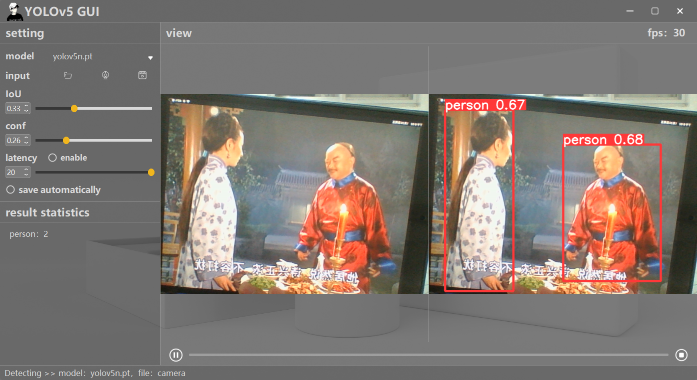
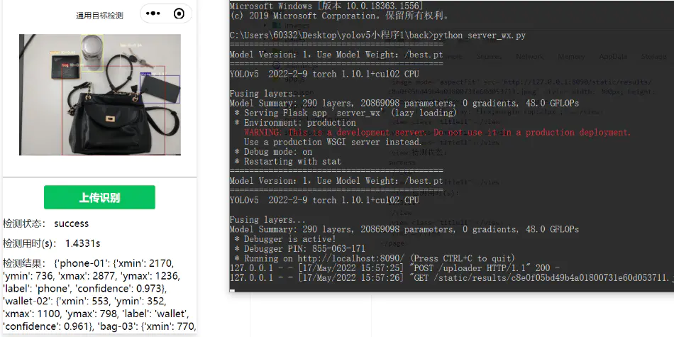
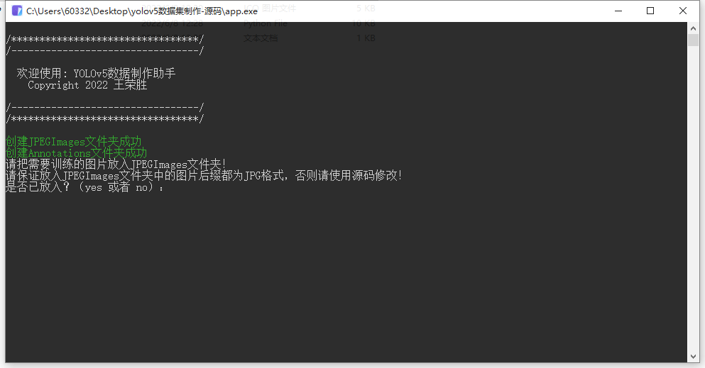
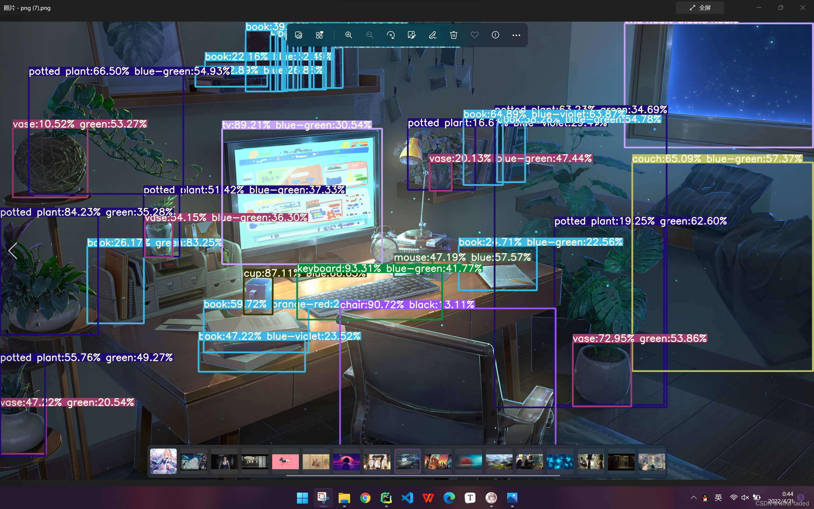
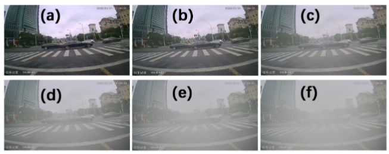
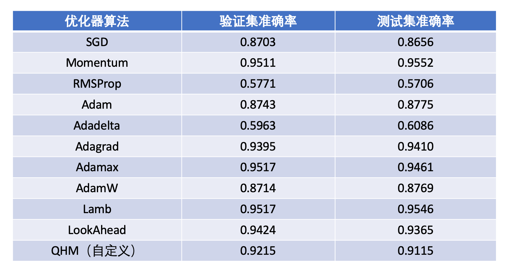

<div align="center"></div>

BestYOLO是一个以科研和竞赛为导向的最好的YOLO实践框架!

目前BestYOLO是一个完全基于[YOLOv5 v7.0](https://github.com/ultralytics/yolov5/tree/v7.0) 进行改进的开源库，该库将始终秉持以落地应用为导向，以轻便化使用为宗旨，简化各种模块的改进。目前已经集成了基于[torchvision.models](https://pytorch.org/vision/stable/index.html) 模型为Backbone的YOLOv5目标检测算法，同时也将逐渐开源更多YOLOv5应用程序。

# 🌟改进

- [Backbone-ResNet18](https://github.com/WangRongsheng/BestYOLO/blob/main/models/backbone/resnet18.yaml) 对齐 [resnet18](https://pytorch.org/vision/stable/models/generated/torchvision.models.resnet18.html#torchvision.models.resnet18)
- [Backbone-RegNet_y_400mf](https://github.com/WangRongsheng/BestYOLO/blob/main/models/backbone/RegNety400.yaml) 对齐 [regnet_y_400mf](https://pytorch.org/vision/stable/models/generated/torchvision.models.regnet_y_400mf.html#torchvision.models.regnet_y_400mf)
- [Backbone-MobileNetV3 small](https://github.com/WangRongsheng/BestYOLO/blob/main/models/backbone/MobileNetV3s.yaml) 对齐 [mobilenet_v3_small](https://pytorch.org/vision/stable/models/generated/torchvision.models.mobilenet_v3_small.html#torchvision.models.mobilenet_v3_small)
- [Backbone-EfficientNet_B0](https://github.com/WangRongsheng/BestYOLO/blob/main/models/backbone/efficientnet_b0.yaml) 对齐 [efficientnet_b0](https://pytorch.org/vision/stable/models/generated/torchvision.models.efficientnet_b0.html#torchvision.models.efficientnet_b0)
- [Backbone-ResNet34](https://github.com/WangRongsheng/BestYOLO/blob/main/models/backbone/resnet34.yaml) 对齐 [resnet34](https://pytorch.org/vision/stable/models/generated/torchvision.models.resnet34.html#torchvision.models.resnet34)
- [Backbone-ResNet50](https://github.com/WangRongsheng/BestYOLO/blob/main/models/backbone/resnet50.yaml) 对齐 [resnet50](https://pytorch.org/vision/stable/models/generated/torchvision.models.resnet50.html#torchvision.models.resnet50)
- [Backbone-EfficientNetV2_s](https://github.com/WangRongsheng/BestYOLO/blob/main/models/backbone/efficientnet_v2_s.yaml) 对齐 [efficientnet_v2_s](https://pytorch.org/vision/stable/models/generated/torchvision.models.efficientnet_v2_s.html#torchvision.models.efficientnet_v2_s)
- [Backbone-EfficientNet_B1](https://github.com/WangRongsheng/BestYOLO/blob/main/models/backbone/efficientnet_b1.yaml) 对齐 [efficientnet_b1](https://pytorch.org/vision/stable/models/generated/torchvision.models.efficientnet_b1.html#torchvision.models.efficientnet_b1)
- [Backbone-MobileNetV2](https://github.com/WangRongsheng/BestYOLO/blob/main/models/backbone/mobilenet_v2.yaml) 对齐 [mobilenet_v2](https://pytorch.org/vision/stable/models/generated/torchvision.models.mobilenet_v2.html#torchvision.models.mobilenet_v2)
- [Backbone-wide_resnet50_2](https://github.com/WangRongsheng/BestYOLO/blob/main/models/backbone/wide_resnet50_2.yaml) 对齐 [wide_resnet50_2](https://pytorch.org/vision/stable/models/generated/torchvision.models.wide_resnet50_2.html#torchvision.models.wide_resnet50_2)
- [Backbone-VGG11_BN](https://github.com/WangRongsheng/BestYOLO/blob/main/models/backbone/vgg11_bn.yaml) 对齐 [vgg11_bn](https://pytorch.org/vision/stable/models/generated/torchvision.models.vgg11_bn.html#torchvision.models.vgg11_bn)
- [Backbone-Convnext Tiny](https://github.com/WangRongsheng/BestYOLO/blob/main/models/backbone/convnext_tiny.yaml) 对齐 [convnext_tiny](https://pytorch.org/vision/stable/models/generated/torchvision.models.convnext_tiny.html#torchvision.models.convnext_tiny)

> 所有Backbone都支持开启预训练权重，只需添加`pretrained=True`到每个[common.py](https://github.com/WangRongsheng/BestYOLO/blob/main/models/common.py#L870) 的模型中。`torchvision.models`中的预训练权重都是基于ImageNet-1K数据集训练的！

|models|layers|parameters|model size(MB)|
|:-|:-|:-|:-|
|yolov5n|214|1766623|3.9|
|MobileNetV3s|313|2137311|4.7|
|efficientnet_b0|443|6241531|13.0|
|RegNety400|450|5000191|10.5|
|ResNet18|177|12352447|25.1|
|ResNet34|223|22460607|45.3|
|ResNet50|258|27560895|55.7|
|EfficientNetV2_s|820|22419151|45.8|
|efficientnet_b1|539|6595615|13.8|
|mobilenet_v2|320|4455295|9.4|
|wide_resnet50_2|258|70887103|142.3|
|vgg11_bn|140|10442879|21.9|
|convnext_tiny|308|29310175|59.0|

> `.yaml`配置文件中的`depth_multiple`和`width_multiple`可以同时设置为1试试，说不定会有不错的效果。

> SPP是空间金字塔池化，作用是一个实现一个自适应尺寸的输出。（传统的池化层如最大池化、平均池化的输出大小是和输入大小挂钩的，但是我们最后做全连接层实现分类的时候需要指定全连接的输入，所以我们需要一种方法让神经网络在某层得到一个固定维度的输出，而且这种方法最好不是resize（resize会失真），由此SPP应运而生，其最早是何凯明提出，应用于RCNN模型）。当今的SPP在faster-rcnn上已经发展为今天的Multi-Scale-ROI-Align，而在Yolo上发展为SPPF。

- [yolov5n(SPPF)](https://github.com/WangRongsheng/BestYOLO/blob/main/models/yolov5n.yaml)
- [yolov5n-SPP](https://github.com/WangRongsheng/BestYOLO/blob/main/models/SPP/yolov5n-SPP.yaml)
- [yolov5n-SimSPPF](https://github.com/WangRongsheng/BestYOLO/blob/main/models/SPP/yolov5n-SimSPPF.yaml)
- [yolov5n-ASPP](https://github.com/WangRongsheng/BestYOLO/blob/main/models/SPP/yolov5n-ASPP.yaml)
- [yolov5n-RFB](https://github.com/WangRongsheng/BestYOLO/blob/main/models/SPP/yolov5n-RFB.yaml)
- [yolov5n-SPPCSPC](https://github.com/WangRongsheng/BestYOLO/blob/main/models/SPP/yolov5n-SPPCSPC.yaml)
- [yolov5n-SPPCSPC_group](https://github.com/WangRongsheng/BestYOLO/blob/main/models/SPP/yolov5n-SPPCSPC_group.yaml)
- [yolov5n-SimCSPSPPF](https://github.com/WangRongsheng/BestYOLO/blob/main/models/SPP/yolov5n-SimCSPSPPF.yaml)

|models|layers|parameters|
|:-|:-|:-|
|yolov5n(SPPF)|214|1766623|
|yolov5n-SPP|217|1766623|
|yolov5n-SimSPPF|216|1766623|
|yolov5n-ASPP|214|3831775|
|yolov5n-RFB|251|1932287|
|yolov5n-SPPCSPC|232|3375071|
|yolov5n-SPPCSPC_group|232|2047967|
|yolov5n-SimCSPSPPF|229|3375071|

- [yolov5n](https://github.com/WangRongsheng/BestYOLO/blob/main/models/yolov5n.yaml)
- [yolov5n-FPN-AC](https://github.com/WangRongsheng/BestYOLO/blob/main/models/Attention/Self/yolov5n-FPN-AC.yaml)
- [yolov5n-PAN-AC](https://github.com/WangRongsheng/BestYOLO/blob/main/models/Attention/Self/yolov5n-PAN-AC.yaml)
- [yolov5n-FPN+PAN-AC](https://github.com/WangRongsheng/BestYOLO/blob/main/models/Attention/Self/yolov5n-FPN+PAN-AC.yaml)
- [yolov5n-FPN-AS](https://github.com/WangRongsheng/BestYOLO/blob/main/models/Attention/Self/yolov5n-FPN-AS.yaml)
- [yolov5n-PAN-AS](https://github.com/WangRongsheng/BestYOLO/blob/main/models/Attention/Self/yolov5n-PAN-AS.yaml)
- [yolov5n-FPN+PAN-AS](https://github.com/WangRongsheng/BestYOLO/blob/main/models/Attention/Self/yolov5n-FPN+PAN-AS.yaml)

|models|layers|parameters|
|:-|:-|:-|
|yolov5n|214|1766623|
|yolov5n-FPN-AC|188|1858399|
|yolov5n-PAN-AC|186|1642591|
|yolov5n-FPN+PAN-AC|160|1734367|
|yolov5n-FPN-AS|204|2106847|
|yolov5n-PAN-AS|194|1891039|
|yolov5n-FPN+PAN-AS|184|2231263|

- [Optimal Transport Assignment](https://github.com/WangRongsheng/BestYOLO/blob/main/train.py#L476)
- [辅助训练Optimal Transport Assignment](https://github.com/WangRongsheng/BestYOLO/blob/main/train_AuxOTA.py#L255)
- [Soft-NMS](https://github.com/WangRongsheng/BestYOLO/blob/main/utils/general-softnms.py)

> 训练不要使用`Soft-NMS`，耗时太久，请在`val`阶段开启，适用于小目标重叠数据。

- [Decoupled-head](https://blog.csdn.net/weixin_43694096/article/details/127427578)
- [DCNv2](https://github.com/WangRongsheng/BestYOLO/blob/main/models/backbone/yolov5n-DCN.yaml)
- [WBF](https://github.com/WangRongsheng/BestYOLO/blob/main/wbf.py)
- [DCNv3](https://www.bilibili.com/video/BV1LY411z7iE)
- [NWD](https://www.bilibili.com/video/BV1zY4y197UP/)

# 💻应用

- [TFjs部署使用](https://github.com/WangRongsheng/BestYOLO/tree/main/deploy/yolov5_tfjs_flask)
- [TensorRT部署YOLOv5](https://github.com/WangRongsheng/BestYOLO/tree/main/deploy/yolov5_TensorRT)

- [Pyqt GUI使用](https://github.com/WangRongsheng/BestYOLO/tree/main/deploy/gui)

<div align="center"></div>

- [YOLOv5微信小程序](https://mbd.pub/o/bread/mbd-YpqZlZls)

<div align="center"></div>

- [YOLOv5数据集制作助手](https://github.com/WangRongsheng/BestYOLO/tree/main/deploy/yolov5_maketools)

<div align="center"></div>

- [YOLOv5单框多标签](https://github.com/WangRongsheng/BestYOLO/tree/main/deploy/yolov5_multi-lable)

<div align="center"></div>

- [Fogging Augment](https://github.com/WangRongsheng/BestYOLO/tree/main/deploy/fog_augment)

<div align="center"></div>

# 🌈技巧

- [YOLOv5模型训练测试以及多端部署教学内容](https://lncoder.blog.csdn.net/article/details/124860809)
- [从零到一看懂YOLOv5-OneFlow实现](https://start.oneflow.org/oneflow-yolo-doc/index.html)
- [YOLOV5的FPS计算问题](https://blog.csdn.net/m0_56247038/article/details/126673489)
- [YOLO系列的Neck模块介绍](https://blog.csdn.net/baidu_38262850/article/details/126148560)
- [YOLOv5数据增强详解](https://blog.csdn.net/OpenDataLab/article/details/127788561) ([hyp.scratch-low.yaml](https://github.com/WangRongsheng/BestYOLO/blob/main/data/hyps/hyp.scratch-low.yaml) 和 [augmentations.py](https://github.com/WangRongsheng/BestYOLO/blob/main/utils/augmentations.py))
- [YOLOv5任意版本添加Grad-CAM热图可视化](https://lncoder.blog.csdn.net/article/details/127274025)
- [YOLOv5训练出的模型权重加解密方法](https://lncoder.blog.csdn.net/article/details/124560378)
- [YOLOv5系列：6.修改Soft-NMS,Soft-CIoUNM...](https://blog.csdn.net/qq_38668236/article/details/126245080)
- [YOLOv5系列：空间金字塔池化改进 SPPF / SPPFCSPC...](https://yolov5.blog.csdn.net/article/details/126354660)
- [YOLOv5|针对视觉任务的独立自注意力层](https://yolov5.blog.csdn.net/article/details/127456629)
- [YOLOv5项目代码加密](https://lncoder.blog.csdn.net/article/details/124560237)
- [YOLOv5：添加漏检率和虚检率输出](https://blog.csdn.net/qq1198768105/article/details/126214241)
- [YOLOv5解析 | 绘制results.csv文件数据对比图](https://mtyjkh.blog.csdn.net/article/details/125048528)
- [YOLOv5的Tricks-图片采样策略——按数据集各类别权重采样](https://clichong.blog.csdn.net/article/details/125224472)
- [YOLOv5如何进行区域目标检测（手把手教学）](https://blog.csdn.net/qq_39740357/article/details/125149010)
- [2D目标检测论文大盘点（37篇）](https://yolov5.blog.csdn.net/article/details/123917131)
- [连夜看了30多篇改进YOLO的中文核心期刊](https://yolov5.blog.csdn.net/article/details/124487528)
- [知网最新改进 YOLO 核心论文合集 | 22篇创新点速览](https://yolov5.blog.csdn.net/article/details/128292579)

---

1. 小目标检测大杀器：[yolov5-pip](https://github.com/fcakyon/yolov5-pip) 和[sahi](https://github.com/obss/sahi)
2. 小目标检测大杀器：[填鸭式数据增强](https://github.com/zengwb-lx/Detection_Augmentation)
> 应注意：训练和推理数据保持相同的数据形式，即不能通过非切图训练，根据切图推理！
3. 一个不成熟的优化器选择参考：
<div align="center"></div>

# 📋参考

- [https://github.com/ultralytics/yolov5/tree/v7.0](https://github.com/ultralytics/yolov5/tree/v7.0)
- [https://github.com/ppogg/YOLOv5-Lite](https://github.com/ppogg/YOLOv5-Lite)
- [https://github.com/deepcam-cn/yolov5-face](https://github.com/deepcam-cn/yolov5-face)
- [https://github.com/Gumpest/YOLOv5-Multibackbone-Compression](https://github.com/Gumpest/YOLOv5-Multibackbone-Compression)
- [https://github.com/jizhishutong/YOLOU](https://github.com/jizhishutong/YOLOU)
- [https://github.com/Bobo-y/flexible-yolov5](https://github.com/Bobo-y/flexible-yolov5)
- [https://github.com/iscyy/yoloair](https://github.com/iscyy/yoloair)
- [https://github.com/WangQvQ/Yolov5_Magic](https://github.com/WangQvQ/Yolov5_Magic)
- [https://github.com/Hongyu-Yue/yoloV5_modify_smalltarget](https://github.com/Hongyu-Yue/yoloV5_modify_smalltarget)
- [https://github.com/wuzhihao7788/yolodet-pytorch](https://github.com/wuzhihao7788/yolodet-pytorch)
- [https://github.com/iscyy/yoloair2](https://github.com/iscyy/yoloair2)
- [https://github.com/positive666/yolo_research](https://github.com/positive666/yolo_research)
- [https://github.com/Javacr/PyQt5-YOLOv5](https://github.com/Javacr/PyQt5-YOLOv5)
- [https://github.com/yang-0201/YOLOv6_pro](https://github.com/yang-0201/YOLOv6_pro)
- [https://github.com/yhwang-hub/dl_model_deploy](https://github.com/yhwang-hub/dl_model_deploy)
- [https://github.com/FeiYull/TensorRT-Alpha](https://github.com/FeiYull/TensorRT-Alpha)
- [https://github.com/sjinzh/awesome-yolo-object-detection](https://github.com/sjinzh/awesome-yolo-object-detection)
- [https://github.com/z1069614715/objectdetection_script](https://github.com/z1069614715/objectdetection_script)
- [https://github.com/icey-zhang/SuperYOLO](https://github.com/icey-zhang/SuperYOLO)
- [https://github.com/akashAD98/awesome-yolo-object-detection](https://github.com/akashAD98/awesome-yolo-object-detection)

# 💫工作

- [https://github.com/cv516Buaa/tph-yolov5](https://github.com/cv516Buaa/tph-yolov5)
- [https://github.com/icey-zhang/SuperYOLO](https://github.com/icey-zhang/SuperYOLO)
- [https://github.com/luogen1996/OneTeacher](https://github.com/luogen1996/OneTeacher)
- [https://github.com/AlibabaResearch/efficientteacher](https://github.com/AlibabaResearch/efficientteacher)
- [https://github.com/YOLOonMe/EMA-attention-module](https://github.com/YOLOonMe/EMA-attention-module)
- [https://github.com/maggiez0138/yolov5_quant_sample](https://github.com/maggiez0138/yolov5_quant_sample)
- [https://github.com/OutBreak-hui/YoloV5-Flexible-and-Inference](https://github.com/OutBreak-hui/YoloV5-Flexible-and-Inference)
- https://github.com/Johnathan-Xie/ZSD-YOLO
- https://github.com/chengshuxiao/YOLOv5-ODConvNeXt
- https://github.com/LSH9832/edgeyolo
- https://github.com/Koldim2001/YOLO-Patch-Based-Inference

# 🔔引用

```python
@article{2023bestyolo,
  title={{BestYOLO}: Making research and competition easier},
  author={Rongsheng Wang},
  repo={github https://github.com/WangRongsheng/BestYOLO},
  year={2023}
}
```

# 🚀贡献
[](https://github.com/WangRongsheng/BestYOLO/network/members)

[](https://github.com/WangRongsheng/BestYOLO/stargazers)

[](https://star-history.com/#WangRongsheng/BestYOLO&Date)
